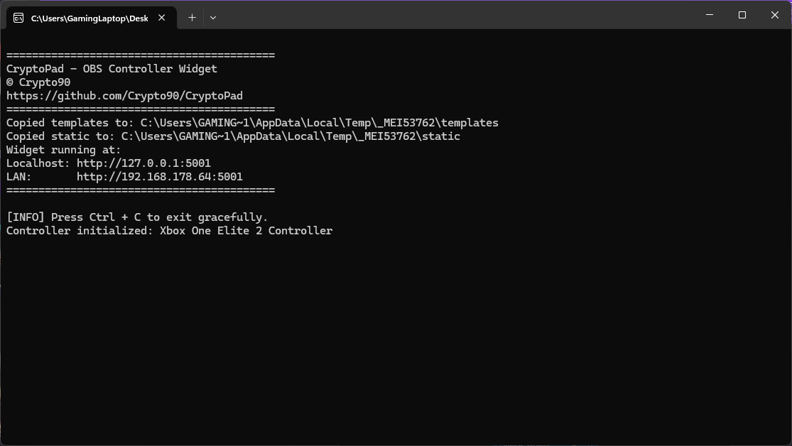
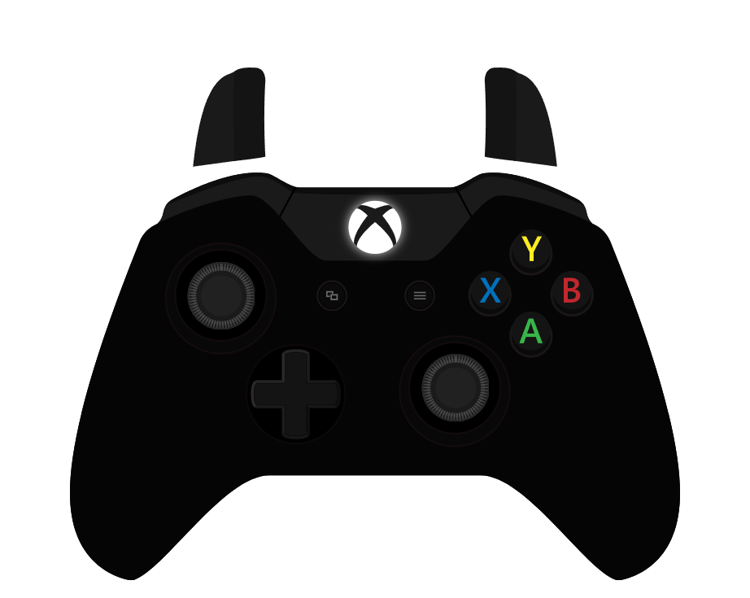
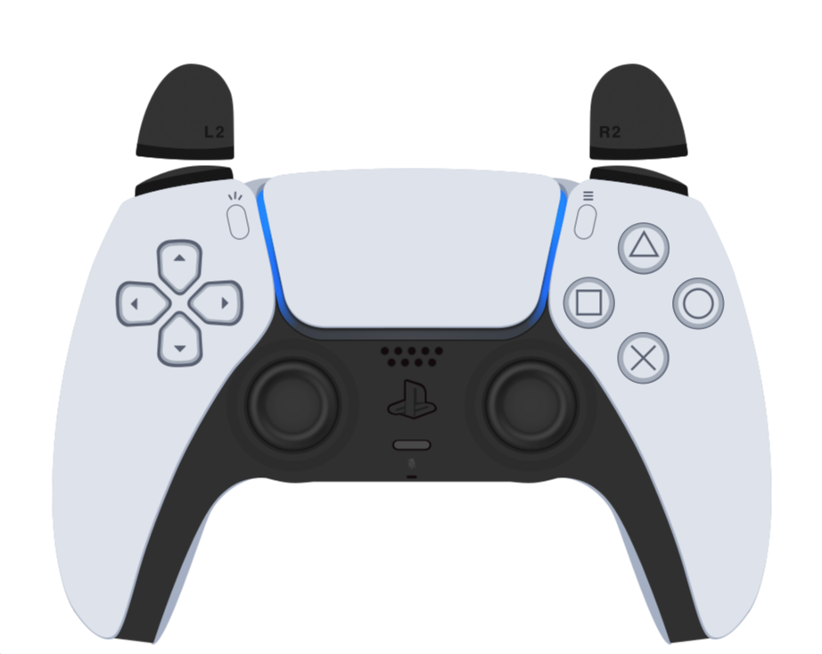

# CryptoPad - OBS Controller / Gamepad Widget
Download prebuild binary (.exe) version which is ready to run:

[Download v0.0.7](https://github.com/Crypto90/CryptoPad/releases/download/0.0.7/CryptoPad_v0.0.7.zip)

Current controller / gamepad templates:
- Xbox
- PS5

Manual .py script run requires:

pip install flask flask-socketio pygame eventlet requests

Then you can run it by:

python CryptoPad.py

To build the exe yourself use:

pyinstaller CryptoPad.spec

