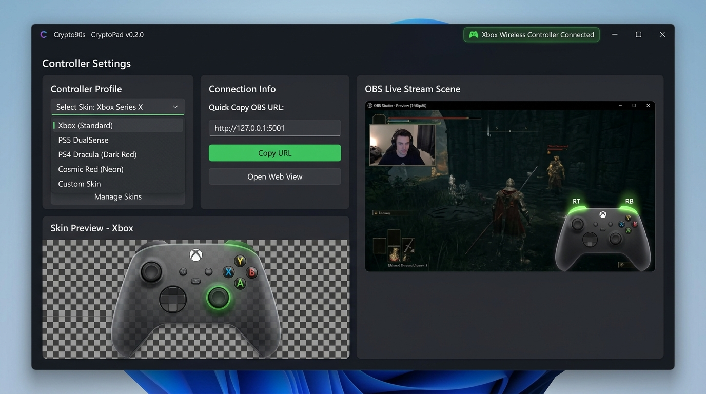

<div align="center">


# 🎮 Crypto90's CryptoPad

**High-Performance Real-Time OBS Gamepad / Controller Streaming Overlay**

[](https://github.com/Crypto90/CryptoPad/releases)
[](https://github.com/Crypto90/CryptoPad)
[](./LICENSE)
[](https://www.python.org/)
[](https://github.com/Crypto90/CryptoPad/actions)
[](https://ko-fi.com/crypto90)

<p align="center">
  <a href="#-download-pre-built-executable"><b>Download Executable</b></a> •
  <a href="#-key-features"><b>Key Features</b></a> •
  <a href="#-screenshot"><b>UI Preview</b></a> •
  <a href="#-controller-skin-catalog"><b>Skin Catalog</b></a> •
  <a href="#-obs-studio-setup-guide"><b>OBS Setup Guide</b></a> •
  <a href="#-how-it-works"><b>How It Works</b></a> •
  <a href="#-building-from-source"><b>Build Guide</b></a>
</p>

</div>

---

## 💡 Overview

Displaying live controller inputs on stream is one of the most effective ways to engage viewers during speedruns, fighting games, Souls-likes, and competitive matches.

**Crypto90's CryptoPad** is a standalone, ultra-low latency controller visualizer designed for **OBS Studio**, **Streamlabs**, and **Dual-PC streaming rigs**. It captures joystick axes, button presses, trigger values, and d-pad movements directly from any connected game controller via native XInput / DirectInput, broadcasting real-time state telemetry via WebSockets into an OBS Browser Source overlay.

---

## 🚀 Download Pre-built Executable

End-users do **not** need Python installed. Standalone Windows executables are compiled automatically via GitHub Actions:

| Version | Asset | Direct Download | Platform |
| :---: | :---: | :---: | :---: |
| **v0.2.3** *(Latest)* | `CryptoPad.exe` | [**⬇️ Download v0.2.3 Executable**](https://github.com/Crypto90/CryptoPad/releases/download/0.2.3/CryptoPad.exe) | Windows 10 / 11 (64-bit) |

> 📁 Browse all versions and changelogs in [GitHub Releases](https://github.com/Crypto90/CryptoPad/releases).

---

## ✨ Key Features

<table>
  <tr>
    <td width="50%">
      <h3>🔄 Universal Cross-Controller Mapping</h3>
      Play with an <b>Xbox controller</b> on a <b>PlayStation 4/5</b> skin, or a <b>DualSense</b> on an <b>Xbox</b> skin with zero swapped buttons, inverted axes, or broken D-pads. Includes auto-detection and profile override.
    </td>
    <td width="50%">
      <h3>🎮 12 Handcrafted Gamepad Skins</h3>
      Includes pixel-perfect vector overlays for <b>Xbox Series X/One</b>, <b>PlayStation 5 (DualSense)</b>, and <b>PlayStation 4 (DualShock 4)</b> in Classic, Dracula, Cosmic Red, Blue, White, and Black editions.
    </td>
    <td width="50%">
      <h3>⚡ Ultra Low-Latency WebSockets</h3>
      Broadcasts controller telemetry over high-frequency WebSockets (~33Hz) for zero input lag and instant button/trigger feedback on stream.
    </td>
  </tr>
  <tr>
    <td width="50%">
      <h3>🌐 Dual-PC Streaming & LAN Support</h3>
      Run CryptoPad on your gaming PC while OBS captures the overlay over your local network (<code>http://192.168.x.x:5001</code>) on your dedicated streaming PC.
    </td>
    <td width="50%">
      <h3>🛡️ Safe Dynamic Port Fallback</h3>
      Automatically scans and selects an open port starting from <code>5001</code> if conflicts occur, preventing crashes and displaying active connection links.
    </td>
  </tr>
  <tr>
    <td width="50%">
      <h3>🕹️ Plug-and-Play Hotplugging</h3>
      Automatically detects when controllers are connected or disconnected, displaying live hardware name telemetry (e.g. <i>Xbox Wireless Controller</i>, <i>DualSense Wireless Controller</i>).
    </td>
    <td width="50%">
      <h3>🎨 Windows 11 Fluent Dark Slate GUI</h3>
      Modern desktop manager with live skin preview thumbnails, one-click clipboard URL copying, and an embedded activity diagnostics log.
    </td>
  </tr>
</table>

---

## 📸 Screenshot

<div align="center">
  
</div>

---

## 🎨 Controller Skin Catalog

| Controller Family | Available Skins |
| :--- | :--- |
| **Xbox (Series X / One / 360)** | `Xbox (Standard)`, `Xbox (blue)`, `Xbox (dracula)`, `Xbox (white)` |
| **PlayStation 5 (DualSense)** | `PS5 (Standard)`, `PS5 (black)`, `PS5 (cosmic red)` |
| **PlayStation 4 (DualShock 4)** | `PS4 (Standard)`, `PS4 (blue)`, `PS4 (dracula)`, `PS4 (red)`, `PS4 (white)` |

---

## 🎥 OBS Studio Setup Guide

1. Connect your controller to your PC via USB or Bluetooth.
2. Launch **`CryptoPad.exe`**.
3. Select your desired controller skin from the list.
4. In **OBS Studio**, click **`+` (Add Source) -> `Browser`**.
5. Name the source (e.g., *Gamepad Overlay*).
6. Set the **URL** to:
   ```
   http://127.0.0.1:5001
   ```
   > 💡 **Dual-PC Setup:** Use the **LAN URL** displayed in CryptoPad (e.g., `http://192.168.1.150:5001`).
7. Recommended dimensions:
   - **Width:** `800`
   - **Height:** `600` (or `600 x 450`)
8. Check **"Shutdown source when not visible"** and click **OK**.

---

## 🔄 How It Works

```mermaid
flowchart TD
    A["Gamepad Input (Buttons / Sticks / Triggers / D-Pad)"] --> B["Pygame Low-Level HID Subsystem"]
    B -->|Telemetry Capture (~33Hz)| C["CryptoPad Engine"]
    C --> D["Flask-SocketIO WebSockets Server"]
    D -->|Real-Time Event Broadcast| E["OBS Studio Browser Source"]
    
    E --> F["Jinja2 Controller Template (SVG Elements)"]
    F --> G["Animate Thumbsticks & Analog Triggers"]
    F --> H["Highlight Pressed Buttons & D-Pad"]
    
    C --> I["Desktop Controller Manager (Tkinter)"]
    I --> J["Live Skin Preview & Hotplug Status"]
    I --> K["One-Click Copy URL to Clipboard"]
```

---

## 🛠️ Building from Source

### Prerequisites

- **Python 3.8+** (Windows 10 or 11 recommended)
- Git

### 1. Clone Repository & Install Dependencies

```bash
git clone https://github.com/Crypto90/CryptoPad.git
cd CryptoPad

pip install -r requirements.txt
```

### 2. Run Locally

```bash
python CryptoPad.py
```

### 3. Build Standalone Executable

**Option A (One-Click Script on Windows):**
Double-click `build_exe.bat` in the repository root.

**Option B (Manual Terminal Command):**
```bash
pyinstaller --onefile --noconsole --name "CryptoPad" --add-data "templates;templates" --add-data "static;static" CryptoPad.py
```
The compiled standalone executable will be located in:
```
dist/CryptoPad.exe
```

---

## 🤝 Contributing

Contributions, new controller skins, and bug fixes are warmly welcomed!
1. Fork the repository.
2. Create your feature branch (`git checkout -b feature/amazing-controller-skin`).
3. Commit your changes (`git commit -m 'Add amazing controller skin'`).
4. Push to the branch (`git push origin feature/amazing-controller-skin`).
5. Open a Pull Request.

---

## ☕ Support the Developer

If CryptoPad powers your stream overlays and controller visualizer, please consider buying me a coffee:

<div align="center">

[](https://ko-fi.com/crypto90)

</div>

---

## 📄 License

This project is licensed under the **MIT License**. See the [LICENSE](./LICENSE) file for details.
